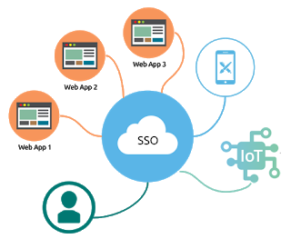

Single sign-on (SSO) is an authentication scheme that allows a user to log in with a single ID and password to any of several related, yet independent, software systems.

	

True single sign-on allows the user to log in once and access services without re-entering authentication factors. It should not be confused with same-sign on (Directory Server Authentication), often accomplished by using the Lightweight Directory Access Protocol (LDAP) and stored LDAP databases on (directory) servers.

Have a look at the following SSO demonstration where the user enters the credentials only once while accessing the 1st service provider, and thus can easily login into the 2nd service provider without the need of providing details again!

 <iframe style="width:100%;height:100%;position:absolute;left:0px;top:0px;"
 frameborder="0" width="100%" height="100%" 
 allowfullscreen allow="autoplay"
 src="
https://drive.google.com/file/d/1uzl5oUWXSC6nuOVc9O0pTFgXwAogCygr/preview
">
</iframe>

 
A simple version of single sign-on can be achieved over IP networks using **cookies** but only if the sites share a common DNS parent domain. As different applications and resources support different authentication mechanisms, single sign-on must internally store the credentials used for initial authentication and translate them to the credentials required for the different mechanisms.

Other shared authentication schemes, such as OpenID and OpenID Connect, offer other services that may require users to make choices during a sign-on to a resource, but can be configured for single sign-on if those other services (such as user consent) are disabled. An increasing number of federated social logons, like Facebook Connect, do require the user to enter consent choices upon first registration with a new resource, and so are not always single sign-on in the strictest sense.