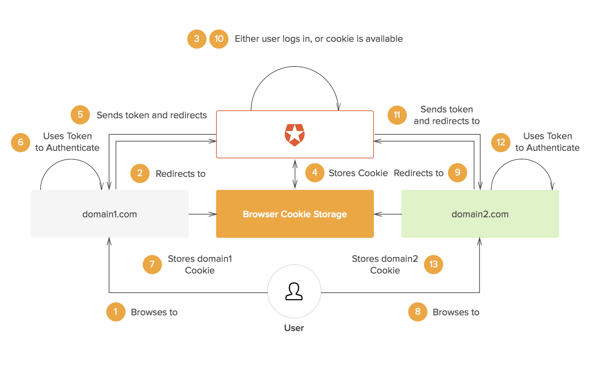

Single Sign On works by having a **central server**, which all the applications trust. When you login for the first time a **cookie** gets created on this central server. Then, whenever you try to access a second application, you get redirected to the central server, if you already have a cookie there, you will get redirected directly to the app with a token, without login prompts, which means you’re already logged in.

	

Different SSO protocols (like SAML, LDAP, OpenID, etc.) share session information in different ways, but the essential concept is the same: there is a central domain (or **Identity provider**), through which authentication is performed, and then the session is shared with other domains in some way.

The central domain generates a signed **Token**, let's say a JSON Web Token (JWT) which may be encrypted using JSON Web Encryption (JWE). This token may then be passed to the client and used by the authentication domain as well as any other domains. The token can be passed to the original domain by a redirect and it contains all the information needed to identify the user for the domain requiring authentication. As the token is signed, it cannot be modified in any way by the client. Whenever users go to a domain that requires authentication, they are redirected to the authentication domain. As users are already logged-in at that domain, they can be immediately redirected to the original domain with the necessary authentication token.

	

A detailed workflow of the SSO is described as follows - 
1. A user browses to the application or website they want access to, the **Service Provider**.
2. The Service Provider sends a token that contains some information about the user, like their name, email address, to the SSO system, or the Identity Provider, as part of a request to authenticate the user.
3. The Identity Provider first checks to see whether the user has already been authenticated, in which case it will grant the user access to the Service Provider application and skip to step 5.
4. If the user hasn’t logged in, they will be prompted to do so by providing the credentials required by the Identity Provider.
5. Once the Identity Provider validates the credentials provided, it will send a token back to the Service Provider confirming a successful authentication. This token is passed through the user’s browser to the Service Provider.
6. The token that is received by the Service Provider is validated according to the trust relationship that was set up between the Service Provider and the Identity Provider during the initial configuration.
7. Finally, the user is granted access to the Service Provider.