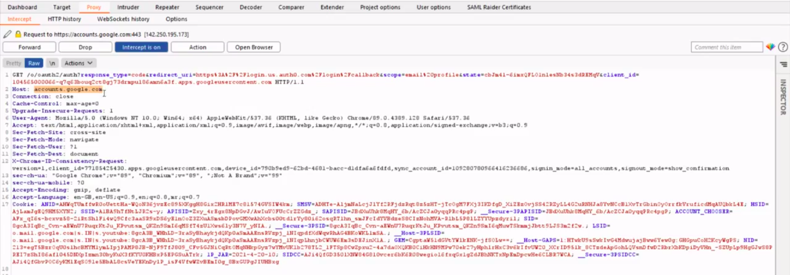
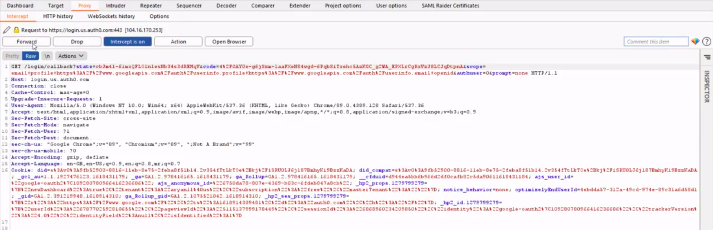
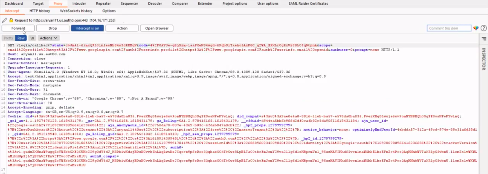
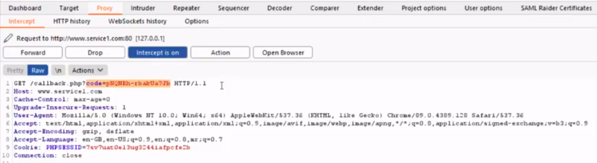
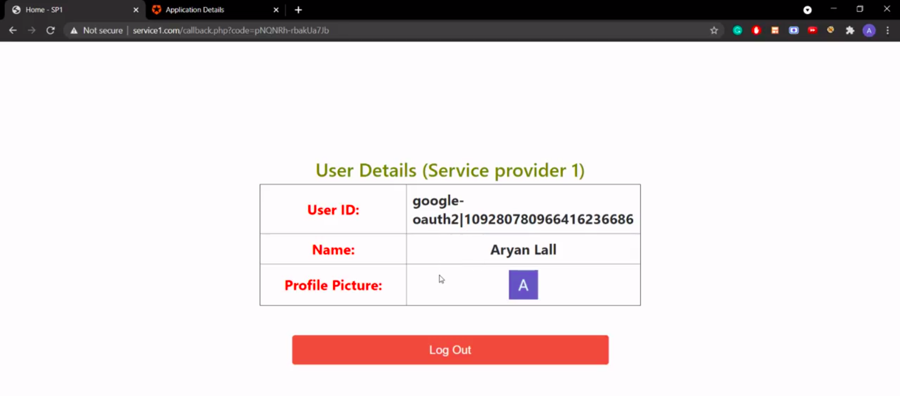
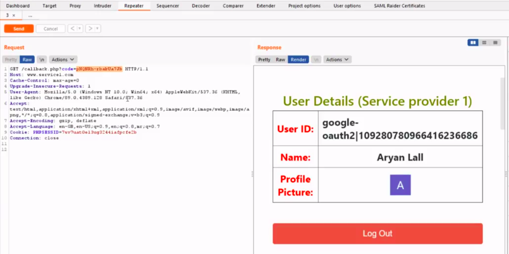
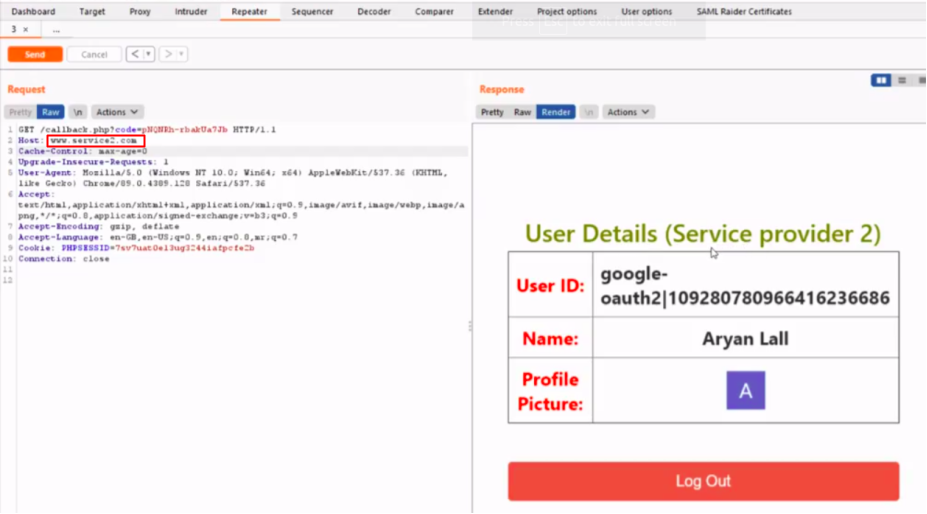
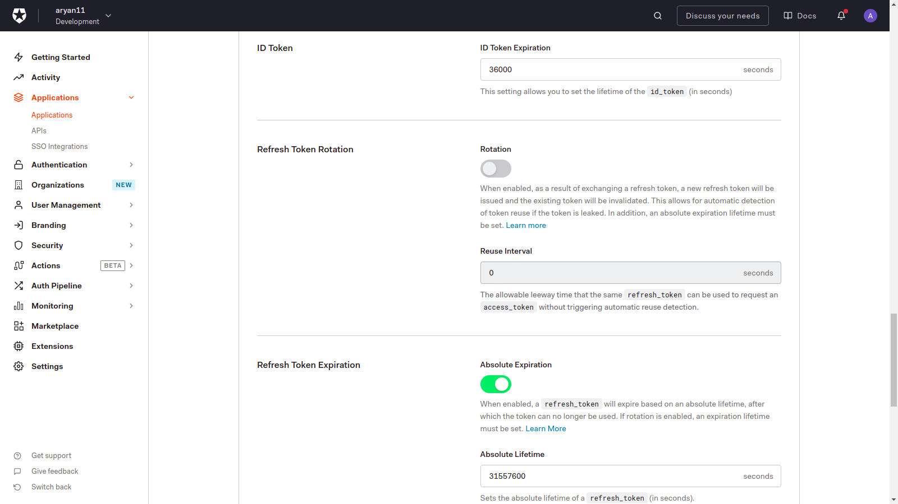

In this page, we will try to demonstrate on how an attacker can hijack a session token and reuse it in the future to log on to the corresponding web services.

We have used the SSO implementation provided by [Auth0](https://auth0.com/). Have a look at the following demonstration which guides on how a token can be hijacked and reused in the future.

 <iframe style="width:100%;height:100%;position:absolute;left:0px;top:0px;"
 frameborder="0" width="100%" height="100%" 
 allowfullscreen allow="autoplay"
 src="
https://drive.google.com/file/d/1C1DdBT6JafLCVcKN0VOkuVQ-qrq_F6It/preview
">
</iframe>

The detailed steps and the explanation of the above demonstration is as follows -

1. **Request for Authentication**

   The user clicks on the "Login via Google" button and thus it requests the Auth0 server to authenticate the user.
   

   		
   

2. **Redirection to Authorization server**

   The user is further redirected to the Google authorization server with the following request. This contains all the parameters that would be verified by the Google authorization server.
   

   		
   

   In response, it demands an Authorization token which could be seen in the "**response_type**" field. The **"scope"** parameter defines the resources that Auth0 needs permission for, like email, profile, etc. The "**redirect_uri**" defines the URL to which the user would be redirected once authenticated.
3. **Authorization Code**

   Once the google server authenticates the user, it sends an authorization code to Auth0
   

   		
   

4. **Request for Access Token**

   Once the Auth0 receives the authorization code, it requests an access token from the google authorization server.
   

   		
   

5. **Access Token granted**

   Once the authorization code is verified, the google server finally sends an **Access token** to Auth0. Further, this is used by auth0 to exchange information such as email, profile, etc. from the google resource server.
   

   		
   

6. **User Authenticated**

   The user is finally authenticated and it redirected to the web service web page.
   

   		
   

## **Let's Hijack :P**
 
We can send the obtained access token to the repeater and replay it in the future to access the web services corresponding to the user's account. This exercise has been demonstrated in the video and the detailed steps are as follows - 
1. **Reusing Access Token**

   The obtained access token is reused and we have successfully logged in to the web service 1. All the user details have been exposed without the need of user actually logging in.
   

   		
   

2. **Reusing Access Token for different Web service**

   The access token might also be used for logging in to other web services of the same domain. For ex - here we have demonstrated that by using the same access token, the attacker is also able to access the **web service 2**, without the need of user actually logging in! This imposes a great threat to all the user applications.
   

   		
   

## **Prevention of Token Hijack**
 
As a security measure, the Auth0 server allows the user to configure the properties of the Token such as **Expiration time**, **refreshing Token expiration**, etc. By setting these fields appropriately, the user can ensure that the token can't be reused after it gets expired.

	

