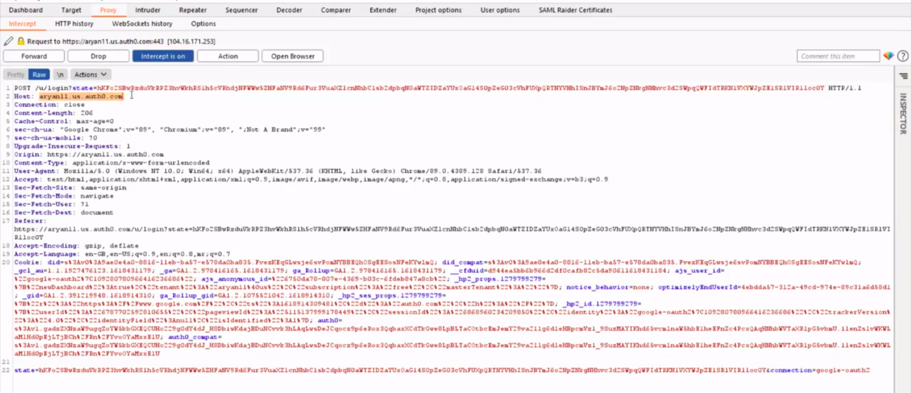
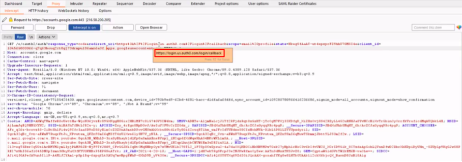
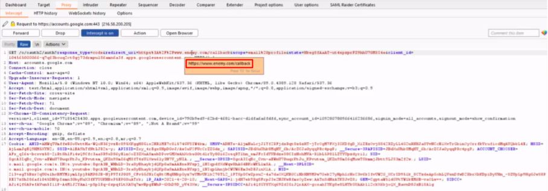
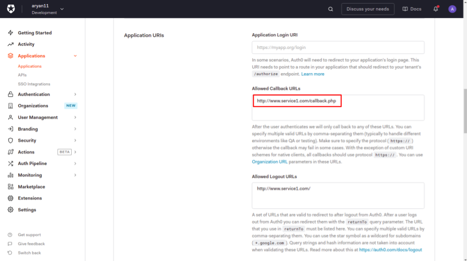
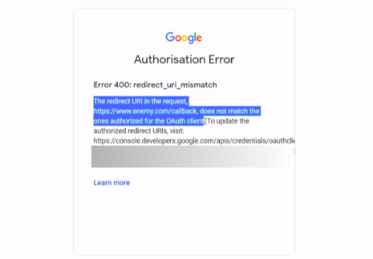

Before we begin, we would recommend the viewer to check out the **Token Hijack** demonstration for a better understanding of the mechanism.

***

In this page, we will try to demonstrate on how an attacker can try to modify the **Redirect URL** to some mallicious site, and thus could easily obtain the access token.

We have used the SSO implementation provided by [Auth0](https://auth0.com/). Have a look at the following demonstration which guides on how a user can be redirected to some mallicious site.

 <iframe style="width:100%;height:100%;position:absolute;left:0px;top:0px;"
 frameborder="0" width="100%" height="100%" 
 allowfullscreen allow="autoplay"
 src="
https://drive.google.com/file/d/1RHrMDVE4YUSlxvO0-6Foz7D510qCkhJD/preview
">
</iframe>

The detailed steps and the explanation of the above demonstration is as follows -

1. **Request for Authentication**

   The user clicks on the "Login via Google" button and thus it requests the Auth0 server to authenticate the user.
   

   		
   

2. **Redirection to Authorization server**

   The user is further redirected to the Google authorization server with the following request. This contains all the parameters that would be verified by the Google authorization server.
   

   		
   

   In response, it demands an Authorization token which could be seen in the "**response_type**" field. The **"scope"** parameter defines the resources that Auth0 needs permission for, like email, profile, etc. The "**redirect_uri**" defines the URL to which the user would be redirected once authenticated.
3. **Inserting Malicious Website**

   An attacker can modify the "redirect_uri" field in the above request. In the above demonstration, the redirect URL is changed to some **www.enemy.com/callback** URL, which provides a gateway for the access token to be visible on the attacker side. All this happens without the knowledge of the user!
   

   		
   

   Rest of the process remains same as the token hijack activity.
4. **Saviour! Unauthorized Redirects**

   As a security measure, the Auth0 server allows the user to configure the authorized/allowed redirect URLs. By setting these fields appropriately, the user can ensure that he/she gets redirected to only trusted websites, thus preventing any sort of malicious activity.
	

		
	

5. **Google server rejects the Authentication**

   Due to the above setting, the google authorization server rejects the request and diplays an error message saying that the redirect URL doesn't matches the one authorized for the OAuth client
   

   		
   

Thus, it becomes very important to carefully set the security parameters of the authentication server. These demonstrations help in increasing the user awareness about different security aspects and how to handle them carefully!